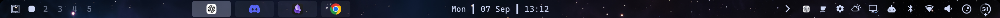

# Layout Strip 1.2.0 — implemented and installed

Completed 7 September 2026. The updated widget, shared Lua backend and matching native bridge are running in the desktop. The health check reports **healthy**, frontend/backend/native protocol **2**, and all required host capabilities. Hyprland reports no configuration errors.

## Completed changes

| Area | Result |
|---|---|
| Clicks and menus | Address-keyed models retain tile objects during title/focus changes and column moves. Removed targets dismiss their menus. |
| Scrolling | Metadata updates preserve active glides. Short arrow clicks make one step. Resizing preserves an already-visible focused tile while respecting deliberate manual scrolling. |
| Errors and actions | Failed reads retain the last good data and show an error. Stale data blocks actions. Shared serialization retains only the latest requested focus; close and reorder are not queued or automatically retried. |
| Performance | One service batches visible monitor reads through typed direct `hyprctl` calls. Event coalescing and a visible-only one-second fallback replace per-monitor Python polling. Geometry reacts to dependencies rather than a 250ms timer. |
| Input protection | Separate 1.5-second leases, geometry updates, explicit cleanup and owner tokens protect normal reload/removal; 3.5-second expiry remains the crash fallback. |
| Desktop scrolling | Workspace-addressed native reads and adjustments repair offscreen closes on another monitor and under floating focus without activating a different window. Successful reorders invalidate old deferred repairs. |
| Omarchy integration | A host adapter owns width measurement, settings, placement and forwarded clicks. Repeated neighbor IDs are matched by instance. Shared webapp identity lookup fixes the Discord icon and follows theme changes. |
| Maintenance | One source repository now contains the widget, backend, native bridge, installer and tests. A narrow bootstrap preserves existing keyboard/gesture controls. Version checks, all-monitor diagnostics, a health command and rollback backups are included. |

Your `shell.json`, selected tape mode, appearance choices and unrelated bindings were preserved. The installed 31 managed source files match the maintained source; the bindings file differs only by the recognized bootstrap migration.

The updated bar was visually checked after installation:

## Measured transport improvement

Fresh runs used the same four-column workspace, five warmups and 30 measured reads per route.

| Measurement | Old Python route | New direct route |
|---|---:|---:|
| Median read latency | 42.47 ms | 3.23 ms |
| p95 read latency | 49.52 ms | 4.52 ms |
| Mean child-process CPU per read | 42.30 ms | 2.82 ms |

That is approximately **13.2× faster median state reads** and **93.3% less child-process CPU per state read**. These numbers do not measure whole-shell CPU, GPU usage or battery consumption; the separate lease heartbeat also has a cost. The earlier review ran under different system load, so this comparison uses the fresh baseline.

A 10-second live observation recorded 12 coalesced state reads, six region renewals and zero actions, with no backend/region errors or stranded busy state. One live protection region remained registered. Background requests no longer start Python.

## Validation

- 18,226 geometry assertions, 20 insertion cases, and model, host-adapter, icon and protocol suites passed.
- 140 offscreen QML input checks and 14 shared-backend scheduling/timeout checks passed.
- Five Lua suites, 18 Python tests and six installer tests passed, including rollback and symlink preservation/refusal.
- 1,704 C++ reorder cases plus native press-guard and lease-registry tests passed.
- Ten actual private compositor cases across two outputs passed, including nonfocused-monitor and floating-focus closes, addressed reorder, stale-token rejection and owner-safe cleanup. See [native validation and its graphics transport caveat](native-validation.md).
- Live installation, loaded native library, service discovery, capability negotiation, settings preservation and the bar appearance were checked successfully.

Physical touchpad inertia and compositor popup stacking remain outside the offscreen input coverage. Vertical bars, full keyboard traversal of tiles and individual stacked members remain outside the advertised feature set. Existing desktop keyboard and gesture navigation continues through the shared backend.

## Preview clarification

“Camera” in the native implementation means the desktop’s horizontal scroll position. Hovering a tile shows its title. Window thumbnails and live video previews were never part of this widget, and this update adds no capture/render workload for them.

## Source, installation and recovery

Start with the [source README](../README.md), [changelog](../CHANGELOG.md), and [machine-readable validation](implementation-validation.json). Run `hypr-tape-doctor` for a read-only live health check; `omarchy shell user1.layout-strip debug` reports every monitor instance.

On these Omarchy/Qt versions, plugin rescan retained the old component/directory cache and initially failed to discover the new service. `omarchy restart shell` loaded the complete release successfully. The documented installation procedure now includes this step for new QML components. The compositor stayed running.

The previous installed files and native activation manifest are backed up at:

`/home/user1/Documents/Codex/2026-09-07/pe/work/installed-backup-1.2.0`

Its `files.json` records each managed file and its backup; `widget/` contains the prior plugin. Prior immutable native builds remain available. No package-owned Omarchy files were modified, no system graphics library was replaced, and all task-owned private compositor processes were stopped.
